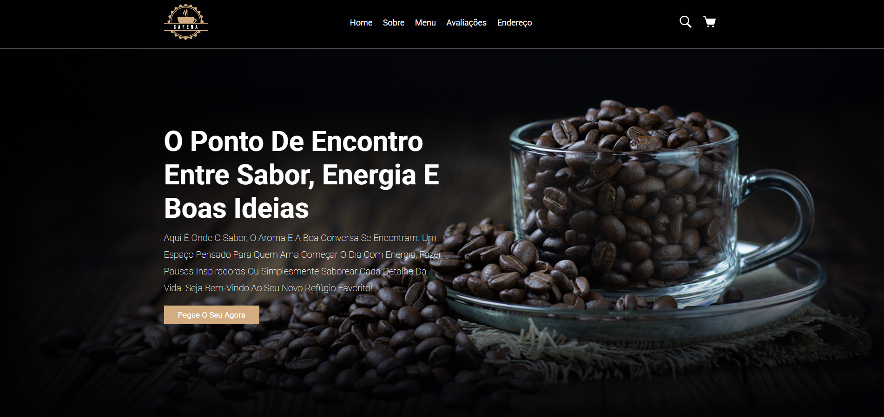
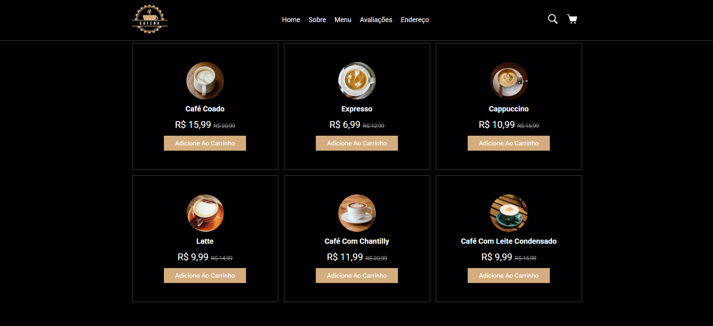

## 🎯 Objetivo do Projeto
Este projeto foi desenvolvido com o intuito de praticar habilidades de desenvolvimento front-end, design responsivo e semântica HTML. Faz parte do meu portfólio pessoal e simula um site institucional para uma cafeteria fictícia.

# ☕ Cafeteria Responsiva


Projeto de site responsivo para uma cafeteria, desenvolvido como parte do meu portfólio com foco em práticas de **HTML** e **CSS**. O design moderno e acolhedor proporciona uma navegação fluida e uma boa apresentação dos produtos e informações do local.

---

## 📚 Índice

- [✨ Funcionalidades](#-funcionalidades)  
- [📸 Capturas de Tela](#-capturas-de-tela)  
- [🛠 Tecnologias Utilizadas](#-tecnologias-utilizadas)  
- [🚀 Como Visualizar](#-como-visualizar)  
- [🎯 Objetivo do Projeto](#-objetivo-do-projeto)  

---

## ✨ Funcionalidades

- 📱 **Layout Responsivo**: adaptado para mobile, tablet e desktop  
- 🎨 **Design Agradável**: visual limpo, moderno e acolhedor  
- ☕ **Página Inicial**: destaque para cafés especiais  
- 🍽️ **Cardápio com Imagens**: apresentação visual dos produtos  
- 📍 **Informações de Contato**: endereço, redes sociais e formas de contato  
- 💫 **Animações Suaves**: para uma navegação mais interativa  
- 🧼 **Código Limpo e Semântico**: facilitando futuras manutenções  

---

## 📸 Capturas de Tela

> *(Adicione prints do site aqui, se desejar)*

  


---

## 🛠 Tecnologias Utilizadas

- HTML5  
- CSS3  
- Flexbox e Media Queries  
- Animações com `transition` e `hover`  
- Estrutura de pastas organizada  

---

## 🚀 Como Visualizar

1. Clone o repositório:
```bash
git clone https://github.com/seu-usuario/nome-do-repositorio.git 
```
2. ✅ Este projeto não requer instalação de dependências ou servidor para ser executado.

